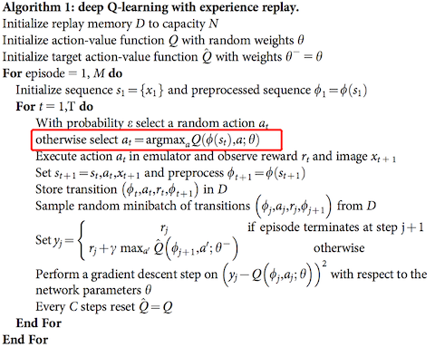
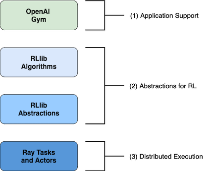
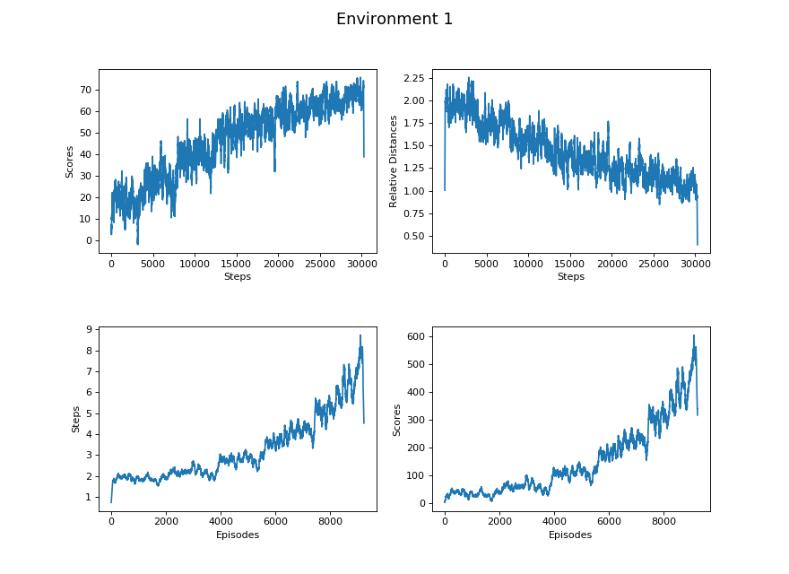
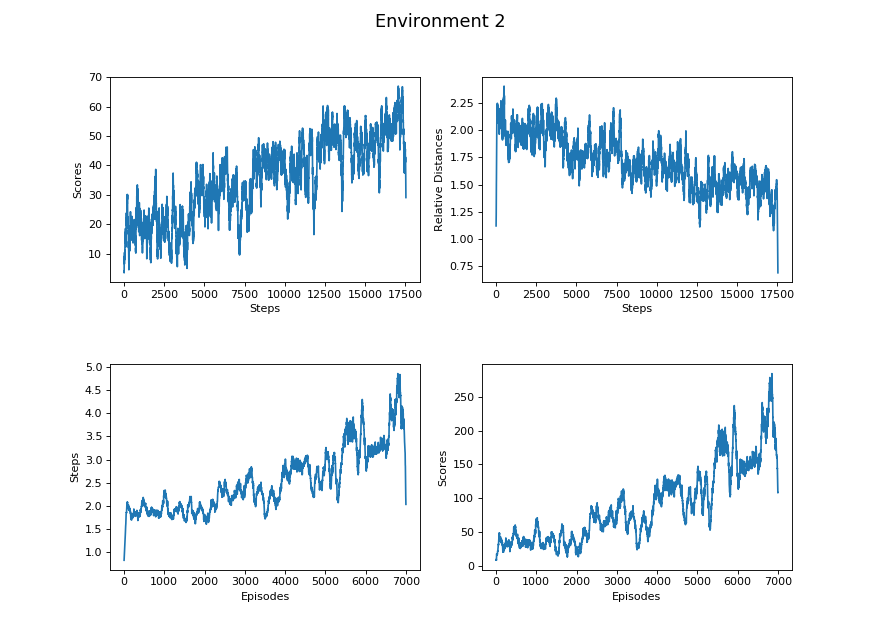
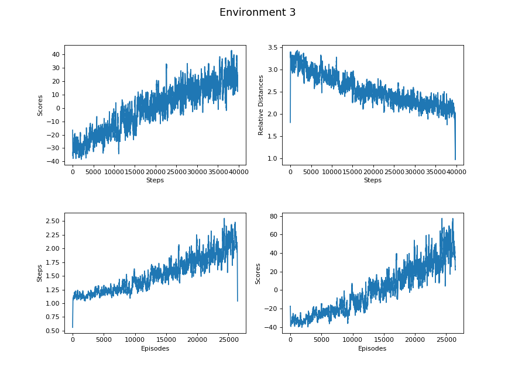
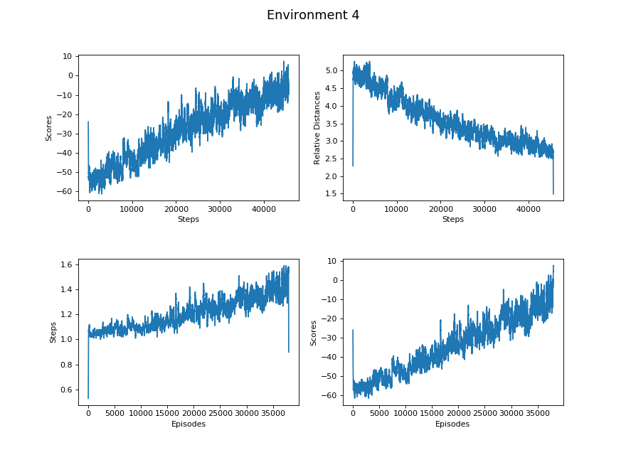
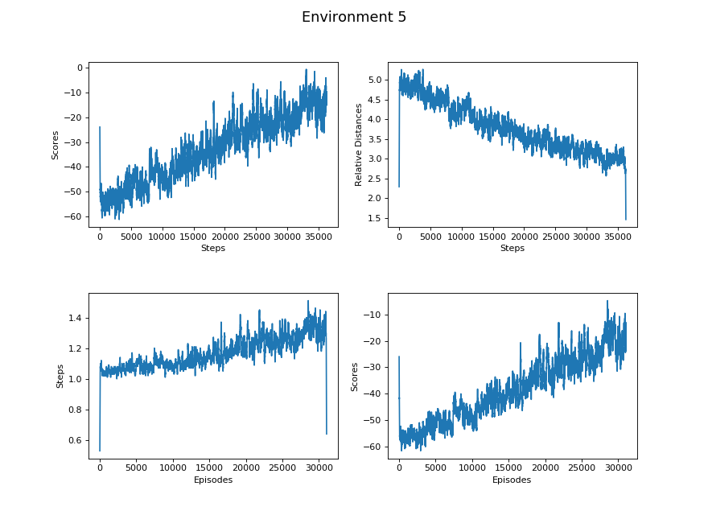

## Video

<iframe width="560" height="315" src="https://www.youtube.com/embed/iSaRsq1KTeU" frameborder="0" allow="accelerometer; autoplay; clipboard-write; encrypted-media; gyroscope; picture-in-picture" allowfullscreen></iframe>
<br>

## Project Summary
The purpose of our project is to let the agent observe his surrounding platforms and then pick an initial velocity from a continuous action space to ensure that the agent can land on various positions of the next platform and hopefully jump onto the glass (goal) block for greater reward. In the final part, we not only allow the agent to choose its own velocity, but we also let the agent choose an angle so that the agent can make a 3D projectile motion jump onto various blocks. We previously used the Q-learning algorithm to solve this problem. However, since velocity and degree are both continuous space, Q-learning cannot perform such calculations. Therefore, we changed our algorithm to the PPO algorithm. By using the PPO algorithm, the agent can learn how to make clever decisions to get more points and jump further with simpler tuning of hyperparameters and less modification to the structure. However, the learning time of the agent is greatly increased due to its policy gradient loss function. <br><br>
Compared with the previous version, we made a huge update in the final version. Since our previous framework can be easily solved with a glass (goal) block always at the center, it’s not trivial in using a machine learning algorithm. The environment and actions offers a higher degree of freedom for the agent. Therefore, the ability of turning and jumping in 3D space is more complex and requires more time into testing and running. Also, we added the ability of observing two different layers, the block layer and the glass(goal block) layer. We also improved the agent's ability to compute jump angles and velocities, and we used PPO so that the agent can perform continuous actions. In order to better observe the agent's resilience to different environments, we added four different levels of difficulty. For the first difficulty, a complete 3x3 platform and then glass(goal) block in the middle of the platform. However, as the difficulty increases, the number of blocks decreases reasonably and then the glass(goal) block is randomly placed in any of the platforms. In this project, although we aimed for the agent to jump further, the agent successfully learned to jump to the platform that scored more points instead of the platform that was further away. 


## Approaches
### Machine Learning Algorithm
This project includes continuous actions for both degree and velocity, so the environment is difficult and the state space is extremely large. As it was stated in both  our proposal and status report, we intended to solve the problem with the implementation of Deep Q learning. However, it was not a realistic choice. Due to the property of the continuous variables, we have an infinite number of state spaces(continuous action space). If we were to use DQN, action space must be converted to a discrete space while other inputs remain the same. A continuous state space will certainly cause the DQN model to overfit and to fail. As shown in figure, DQN won’t be able to locate the action with the highest reward because it is impossible to loop through all the accessible actions from an infinitely large action space. And using only discrete movements would greatly decrease the difficulty of the problem, we consequently decided to retain the continuous state space and moved to PPO(Proximal Policy Optimization), an algorithm that is on-policy instead of off-policy.
<br><br>

 Figure 1. DQN Algorithm<br>

<br><br>

PPO is an on-policy algorithm that derives policy from the current estimation of the optimal policy and chooses the optimal through the policy. In other words, it makes updates based on the transitions that were obtained by the current policy instead of making an update according to the ideal action as it was in DQN. Here is the equation of PPO, and it’s a built-in trainer of RLlib that is primarily used in this project: <br><br>

**$$L^{CLIP}(\theta) = \hat{E}_t[min(r_t(\theta)\hat{A}_t, clip(r_t(\theta), 1-\epsilon, 1+\epsilon)\hat{A}_t)]$$<br>**

$$\theta:$$ the policy parameter <br>
$$\hat{E}_t:$$ empirical expectation over timesteps <br>
$$r_t:$$ ratio of the probability under new and old policies <br>
$$\hat{A}_t:$$ estimated advantage at time t <br>
$$\epsilon:$$ hyperparameter, usually 0.1 or 0.2 <br>

<br><br>
#### RLlib and PPO

<br>
 Figure 2. RLlib Structure<br>

<br>
With RLlib, the OpenAI Gym is used for our project application because our project is single agent and single policy. With gym.Env, we only needed to specify our observation space and action space (details listed below). Since this is a single agent project, the agent’s action control is based on the derivation of the policy gradient loss function. This policy uses deep neural networks for control with subtle choice of actions, so the improvement of performance is exceedingly slow and it seems to be the case in our project where the boundary velocity is chosen more frequently than others in which it causes the agent to die relatively easily. Therefore, it will create much more noise in returns and have an extremely poor learning rate that requires a large amount of time to train our model. 

<br>
Breaking down this project in particular, our overall aspect in terms of conceptual data flow consists of environment, preprocessor, and policy class (figure 3). Except for the environment, the RLlib built-in preprocessor is used and the policy class comes with the PPO trainer along with the use of PyTorch network. <br>

<br>
 Figure 3. Data Flow <br>
<br>

### Environment 
Level of difficulty: (all maps are randomly generated for each mission) <br>
1. No degree, complete 3x3 platform, glass always centered <br>
2. No degree, complete 3x3 platform, glass randomly at x = 1.5 <br>
3. Restricted degree, complete 3x3 platform, glass randomly at any block <br>
4. Restricted degree, incomplete 3x3 platform, glass may randomly be at any block <br>
5. Wider degree, incomplete 3x3 platform, glass may randomly be at any block <br>

<br>
### Reward System
**Glass Block of Platform:** +100 <br>
**Other Block Type of Platform:** < 90,  based on the relative distance to glass block <br>
**Lava:** < -10,  based on the relative distance to glass block 


<br>
### State Space
All possible combinations of of Observation States and Action States: <br>

**Observation State Space:** $$2^{2 \cdot 5 \cdot 10} = 2^{100}$$ <br>
**Action State Space:** $$\infty$$, infinite number of states because the variables of the action space are continuous. <br>
**State space:** $$\infty \cdot 2^{100}$$ => $$\infty$$<br>


<br>
### Observation Space 
Layers that store information about the next platform with one layer containing all available blocks and the other containing only glass blocks. Also, information of the current platforms or other platforms besides the next platform are excluded. 
<br>

**First Layer:** 5 x 10 storing all available blocks information and air<br>
**Second Layer:** 5 x 10 storing only glass block information and air<br>

<br>

 Figure 4. Observation Layers<br>

<br>
Previously, our observation space was more difficult to interpret than the final version. The previous observation space takes in only one layer of 5 x 10 storing all information both glass blocks and regular blocks. Also, rewards were ignoring the relative distance and made the agent only have the feedback of observation layers and whether its choice of velocity had either failed or succeeded. Since it lacks information of the relative distance in respect of the goal block, it had a negative influence on the agent’s choice of velocity. Therefore, we had added relative distance to its reward system and separated into two layers for better choice of velocity. 

<br>
### Action Space
<br>

#### Velocity
Since degree is taken into account and avoids our agent jumping onto the current platform again, the minimum velocity must be over a distance of 4.25m and the maximum velocity must be under a distance of 9m. The reason for disabling the agent jumping onto the same platform is to get correct and precise observation data for training. <br>
**Velocity = [8.05, 11.72]**

<br>
#### Degree
In order to make this project more complex, the degree of turning can enable the agent to jump to any position of the platform. One of our environments has a restriction on degree range, the degree range is calculated based on the current position of the agent in relation to the platform. If the agent is on the right side of the platform, $$-\theta _{left}$$ is taken into account, else the agent is taking $$-\theta _{right}$$ into account Here is the equation: 
<br><br>
**$$\theta _{left} = \tan^{-1}{\frac{X_{max} - X_{curr}}{Gap_{min} + 1}}$$** <br>
**$$\theta _{right} = \tan^{-1}{\frac{X_{curr}}{Gap_{min} + 1}} $$** <br> 

<br>
In another environment, we granted the agent a relatively more complete control of the degree. However, an increase to the range of choices, especially when it is a continuous state, can greatly impact the reinforcement learning process by adding more noise and complexity to the model. We would want to choose an optimal range of degrees that will add challenge to the agent’s learning process without making the model over complex. The max degree the agent required to travel from one platform to the next platform in the most extreme case is approximately 53 degree. In this environment, the agent is allowed to choose from a larger range of degrees [-53, 53] without other restrictions. <br>
**Degree = [-53, 53]**

<br>
#### Projectile Motion in 3D (Jump Simulation)
The results and the process of the actions are retrieved utilizing the projectile motions formulas. Previously our projectile motions calculation was limited to two dimensions (Y displacement and Z displacement). Now our projectile movement function is able to calculate the projectile motion in three dimensions (X, Y, and Z) to simulate the projectile motion under the influence of horizontal degrees. Here are the equations we used for constant gravitational acceleration: <br>

$$\theta_V$$: Vertical degree <br>
$$\theta_H$$: Horizontal degree

<br>
$$
\begin{array} {ll}
&Horizontal\,(x)\, & &Distal\,(z)\, & &Vertical\,(y)\, \\ \hline
&V_x = V cos \theta_V \cdot cos \theta_H\, & &V_z = V cos \theta_V \cdot sin \theta_H\, & &V_y = V sin \theta_V + a_y \Delta t \\
&a_x = 0\,  & &\,a_z = 0\, & &  \,a_y = -g \\
&\Delta x = V_x \Delta t\, & &\Delta z = V_z \Delta t\, &  &\Delta y = V_y \Delta t + \frac{1}{2} {\Delta t}^2 \\
\end{array}
$$

<br>

Here is our implementation: 
```
def movement (self, v, x, y, z, degree):
  ax = 0
  az = 0 
  ay = -9.8  
  t = 0.08
  d = np.radians(70) 
  degree = -1*degree+90

  M = []

  vx = v * np.cos(d) * np.cos(np.radians(degree)) # cos(degree) give the ratio of x after transformation
  vz = v * np.cos(d) * np.sin(np.radians(degree)) # sin(degree) give the ratio of z after transformation
  vy = v * np.sin(d)

  while True:
      x = x + vx*t
      z = z + vz*t
      y = y + vy*t + 0.5*ay*(t**2)

      vx = vx + ax*t
      vz = vz + az*t
      vy = vy + ay*t

      if y < self.floor:
          break

      M.append([x,y,z])

  return M
```

<br><br>
## Evaluation
### Qualitative
As it was mentioned in our status report, we can qualitatively evaluate the implementation of our solution through the visual performance of the agent such as its choice of movement and the farthest distance it can reach. It is obvious that the agent was making random choices at the beginning of the training process because it kept dying after the first step of the episode. After about 10000+ episodes of training, we can clearly see that the agent has improved its strategy of degree choosing. In an environment without degree restriction, the agent learned to choose a more reasonable degree relative to its current position; for example, if the agent is currently standing at the right most size of a platform, then it would tend to choose a positive degree (toward the left) for the next movement. The agent’s choice of velocity as well has been improving. In both the environment with degree and the environment without degree, we can see that the agent is able to reach more platforms more frequently in the later episodes. In addition, in all the environments, the agent was able to land at positions that are closer to the glass block as episodes pases which means the relative difference has been decreasing and the agent has been refining its choice of velocity and degree to a more optimal state. We thus can come to a conclusion that our agent has been improving overtime.

<br>
### Quantitative
 <br>
&emsp;&emsp;&emsp;&emsp;&emsp;&emsp;&emsp;&emsp;&emsp;&emsp;&emsp;Figure 5.1. No degree, complete 3x3 platform, glass always centered <br>
<br>

 <br>
&emsp;&emsp;&emsp;&emsp;&emsp;&emsp;&emsp;&emsp;&emsp;&emsp;&emsp;Figure 5.2. No degree, complete 3x3 platform, glass randomly at x = 1.5 <br>
<br>

 <br>
&emsp;&emsp;&emsp;&emsp;&emsp;&emsp;&emsp;&emsp;&emsp;&emsp;&emsp;Figure 5.3. Restricted degree, complete 3x3 platform, glass randomly at any block <br>
<br>

 <br>
&emsp;&emsp;&emsp;&emsp;&emsp;&emsp;&emsp;&emsp;&emsp;&emsp;&emsp;Figure 5.4. Restricted degree, incomplete 3x3 platform, glass may randomly be at any block <br>
<br>

 <br>
&emsp;&emsp;&emsp;&emsp;&emsp;&emsp;&emsp;&emsp;&emsp;&emsp;&emsp;Figure 5.5. Wider degree, incomplete 3x3 platform, glass may randomly be at any block <br>
<br>

### Overall Comparison
<br>
#### Steps vs Scores
$$
\begin{array}{|l|l|l|l|l|l|}
\hline
                  & Learning\,\, Rate   & Maximum   & Minimum   & Median   & Mean    \\ \hline
Environment\,\, 1 & 0.001872            & 100      & -99.9322  & 80.2      & 46.0874 \\ \hline
Environment\,\, 2 & 0.002244            & 100      & -99.9322  & 71.8      & 35.4813 \\ \hline
Environment\,\, 3 & 0.001403            & 100      & -101.5310 & -31.9660  & -0.3961 \\ \hline
Environment\,\, 4 & 0.001469            & 100      & -101.2027 & -34.9002  & -9.9136 \\ \hline
Environment\,\, 5 & 0.001082            & 100      & -106.9464 & -44.2300  & -28.321 \\ \hline
\end{array}
$$

<br><br>
#### Steps vs Relative Distance
$$
\begin{array}{|l|l|l|l|l|l|}
\hline
                  & Learning\,\,Rate & Maximum & Minimum & Median & Mean   \\ \hline
Environment\,\, 1 & -0.00003         & 18.9395 & 0.0     & 0.98   & 1.4386 \\ \hline
Environment\,\, 2 & -0.00003         & 18.5408 & 0.0     & 1.7155 & 1.6401 \\ \hline
Environment\,\, 3 & -0.00003         & 9.1531  & 0.0300  & 2.4217 & 2.5423 \\ \hline
Environment\,\, 4 & -0.00004         & 9.1203  & 0.0200  & 2.7770 & 2.8615 \\ \hline
Environment\,\, 5 & -0.00005         & 9.6946  & 0.0316  & 3.4590 & 3.5956 \\ \hline
\end{array}
$$

<br><br>
#### Episodes vs Steps
$$
\begin{array}{|l|l|l|l|l|l|}
\hline
                  & Learning\,\,Rate & Maximum   & Minimum   & Median   & Mean   \\ \hline
Environment\,\, 1 & 0.000531         & 43.0      & 1.0       & 2.0      & 3.3073 \\ \hline
Environment\,\, 2 & 0.000299         & 28.0      & 1.0       & 2.0      & 2.5417 \\ \hline
Environment\,\, 3 & 0.000040         & 17.0      & 1.0       & 1.0      & 1.5296 \\ \hline
Environment\,\, 4 & 0.000026         & 8.0       & 1.0       & 1.0      & 1.3888 \\ \hline
Environment\,\, 5 & 0.000010         & 8.0       & 1.0       & 1.0      & 1.2092 \\ \hline
\end{array}
$$

<br><br>
#### Episodes vs Scores
$$
\begin{array}{|l|l|l|l|l|l|}
\hline
                  & Learning\,\, Rate & Maximum   & Minimum   & Median   & Mean     \\ \hline
Environment\,\, 1 & 0.044356          & 3342.4393 & -107.5069 & 47.6     & 152.8419 \\ \hline
Environment\,\, 2 & 0.024983          & 1713.7326 & -99.9322  & 32.0     & 90.4841  \\ \hline
Environment\,\, 3 & 0.003250          & 1156.237  & -101.5310 & -33.5035 & -0.0059  \\ \hline
Environment\,\, 4 & 0.002422          & 499.5853  & -74.3749  & -36.5832 & -13.6652 \\ \hline
Environment\,\, 5 & 0.001297          & 487.4780  & -95.7373  & -44.0969 & -34.0995 \\ \hline
\end{array}
$$

<br><br>
## References

Malmo
- [Mission Schemas](https://github.com/microsoft/malmo/blob/master/Schemas/MissionHandlers.xsd)
- [Malmo XML Schema Documentation](https://microsoft.github.io/malmo/0.14.0/Schemas/Mission.html)

Physics
- [Physics: Projectile Motion in 2D](https://courses.lumenlearning.com/physics/chapter/3-4-projectile-motion/)
- [Physics: Projectile Motion in 3D](https://people.physics.tamu.edu/mahapatra/teaching/ch3.pdf)
- [Verifying proper displacement range for particular velocity](https://www.omnicalculator.com/physics/projectile-motion)

Machine Learning Algorithm
- [RLlib](https://docs.ray.io/en/latest/rllib.html)
- [RLlib Pytorch Models](https://docs.ray.io/en/latest/rllib-models.html#pytorch-models)
- [PPO OpenAI](https://spinningup.openai.com/en/latest/algorithms/ppo.html)
- [PPO algorithm from Kolby Nottingham](https://campuswire.com/c/GAD12D7F8/feed/133)

Tools 
- [Draw.io](http://draw.io/)
- [Jupyter Notebook](https://docs.anaconda.com/ae-notebooks/user-guide/basic-tasks/apps/jupyter/)
- [LaTex Overleaf](https://www.overleaf.com/learn)
