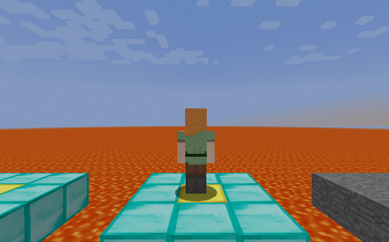

 

Pixel Jump is a game performing physical jump from one point to another with user-control gravitational force and velocity and horizontal degree. The purpose of this project is to let the agent observe his surrounding platforms and then pick an initial velocity from a continuous action space to ensure that the agent can land on various positions of the next platform and hopefully jump onto the glass (goal) block for greater reward. 

Source Code:  [https://github.com/bikaylee/Pixel-Jump]( https://github.com/bikaylee/Pixel-Jump)

### Environment 
Level of difficulty: (all maps are randomly generated for each mission)  
1. No degree, complete 3x3 platform, glass always centered  
2. No degree, complete 3x3 platform, glass randomly at x = 1.5  
3. Restricted degree, complete 3x3 platform, glass randomly at any block  
4. Restricted degree, incomplete 3x3 platform, glass may randomly be at any block  
5. Wider degree, incomplete 3x3 platform, glass may randomly be at any block  

 
### Reward System
**Glass Block of Platform:** +100  
**Other Block Type of Platform:** < 90,  based on the relative distance to glass block  
**Lava:** < -10,  based on the relative distance to glass block 

Reports:

- [Proposal](proposal.html)
- [Status](status.html)
- [Final](final.html)
