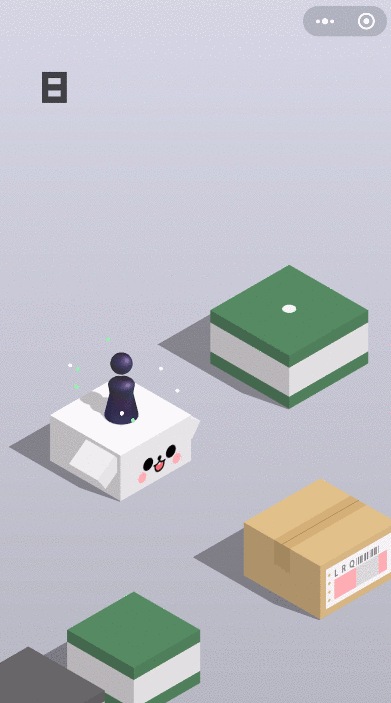

### Summary of the Project
  Our project is a Jump & Jump gameplay stimulation in Minecraft, with different sizes and shapes of platform for the agent to jump on based on gravity and velocity. The goal of our project, Jump Jump, is to observe and learn about the optimal methods of jumping to the next block without trying to swim in lava. In order to give the agent a better learning environment, the agent will receive reward if he lands on the platform and even larger reward if landing on the center of the platform. Otherwise, negative reward is given for trying to swim in lava. The agent does not need to know the direction for the next block because he will be jumping towards one direction. However, his jumping distance will be dependent solely on the velocity picked by the agent. And eventually, the agent will obtain the ability to land on the center of the platform efficiently and reach the farest platform safely.

#### Input: 
the agent state(including the coordinates and the chosen velocity).

#### Output: 
A series of optimal actions to achieve certain goals(landing on the center of the next platform).

 

### AI/ML Algorithms
Reinforcement Learning, physics simulation, and more later on

### Evaluation Plan

#### Quantitative evaluation: 
The metrics can be the reward scores obtained through the reinforcement learning process and the number of center blocks(the block with higher reward) it has landed on. The reward scores will convey about how accurate the agent has landed and how far it reached. The baseline is to have a nonnegative reward score. The metrics and baseline will be improved as we keep revising the algorithms. 

#### Qualitative evaluation:
The agent’s first task in this project is to survive from falling into the lava. The agent will need to pick an initial velocity first in order to start jumping to the next block.  In order to show that the project works, the agent will land on the next block safely and the landing point will get closer to the center of the block after each jump. Otherwise, the agent will restart if he falls into lava.

### Appointment with the Instructor

Our meeting time is: 3:15pm - 3:30pm, Friday, October 23, 2020
